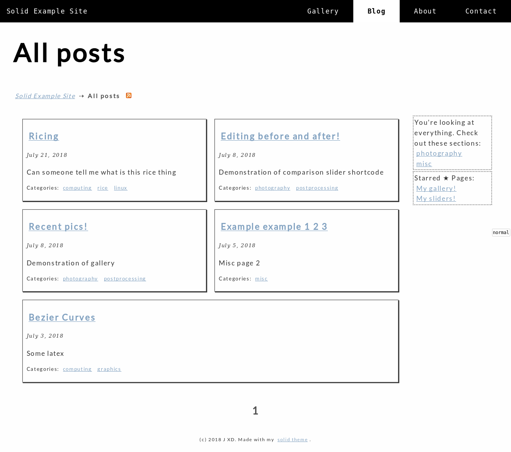

# hugo-solid-theme
A solid theme for hugo.
Focus on minimalism and simplicity.
A plain text page without any extra functionality weighs in at around 300kb.
Because we're here to read your content, not to watch fancy mouseover animations.




## Features
### Overloaded Categories
The categories of Hugo is honestly still a little lacking.
For one, it does not provide any sub-category function.
Thus I simply created a bunch of partials and layouts and turned the paging system into a categorization tool.

What you would do is to now have a different folder your posts.
Instead of `posts`, you would place official content under `categorized`.
Every folder in here is a category as long as it has `_index.md` with the appropriate frontmatter.
Every folder in a category with `_index.md` is a sub-category.
There is no limit to the nesting, but I suggest 2 is a good number.

```
▾ content/
  ▾ categorized/
    ▾ computing/
      ▾ graphics/
          _index.md
          intro.md
        _index.md
```

This creates a category of computing with a sub-category of graphics, with a page `intro.md`.

However due to limitations with Hugo's paging system, we have to add some additional frontmatter to show the page.

#### Required parameters

In your front matter you need to specify a few terms before the page can show up. Namely, the type, and the tags.
Both are used to narrow down the range of pages iterated through.

Hugo on its own does not care about sub-directories.
Thus, everything under `content` is called content, regardless of whatever folder it is in or whatever category it is under.
This is a little annoying, because it means pages like `about.md` or `contact.md` have to have special treatment, or they will show up on the main list that displays all pages.
Thus we specify a type as a filter.
Pages like `about.md` can have a type of for example `post`, and our content pages will have a type of `blog`.
So we do 

```
type = "blog"
```

on **every** post under `categorized`, **including** `_index.md`.
The main thing is that they must be the same. You can choose any word you want.
This is done in the `archetypes` so it is generated by the `hugo new` command.

Another parameter required is `tags`.
This is required to properly define the categories of the page.
You can think of it as a set intersection check.
If the tags of a page intersects with the tags in `_index.md` then it is under that category.

Let us demonstrate that with an example.
Let us return to this directory structure:

```
▾ content/
  ▾ categorized/
    ▾ computing/
      ▾ graphics/
          _index.md
          intro.md
        _index.md
```

In `computing/_index.md` we would specify 

```
tags = ["computing"]
```

and in `computing/graphics/_index.md` we would do:

```
tags = ["graphics"]
```

and in `computing/graphics/intro.md` we would write:

```
tags = ["graphics","computing","anything else"]
```

Then it would show up under both computing and graphics.
If you were to specify only

```
tags = ["graphics"]
```

in `intro.md`, then it will not show up under `computing` because there is no intersection.
This provides a flexible way of sub-categorization that is still relatively easy and fast to do.


### Frontmatter
There are a few things you can activate in the front matter.
These examples are in TOML, so you would enclose them in `+++`.
i.e.

```
+++
date = "..."
title = "..."
+++
```

Check the hugo docs to translate TOML to JSON or YAML.

#### Suggested Categories
Specify an array of `suggestedCategories` to have a sidebar show up in the list page with a few suggested categories.

Used in conjunction with overloaded categories.
For example:
```
suggestedCategories = ["computers", "misc/personal"]
```

Sub categories are denoted with slashes.
This is because it is a simple url substitution.
I do not find it ugly, in fact I think it makes it even clearer that we do not use a separate title.

#### Starred Pages
Now starred pages need a separate title.
Create a table (dictionary) with 2 entries, the title of the page and the url of the page.
For example:

```
[[starredPages]]
title="About"
url="/posts/about"
/
[[starredPages]]
title="My favorite food"
url="/categorized/food/my_fav_food"
```

Note the leading slash.
This creates a sidebar below suggested categories with the pages you specified, in the order you specified them.

#### FeatherLight

[Featherlight](https://noelboss.github.io/featherlight/) is a jQuery plugin that provides lightbox effects (click to expand images).

It is not loaded by default.
If you post requires it, just specify

```
useFL = true
```

In the front matter.

Featherlight also provides a gallery plugin.
If you have multiple images in a row, you can use this to allow users to click through your images.

Enable with:

```
useFLGallery = true
```

Be sure to use the shortcodes below to create these elements automatically!


### Shortcodes
#### sliderfigure
Creates a `<figure>` element with a before/after slider.
Plays an animation when it comes into focus. The slider will move right and then left again to entice the user to grab it.

Enable FL in the front matter first. Then:

```

```

This is done in pure CSS so unfortunately, mobile browsers cannot drag the handle.
However as a workaround the animation for mobile browsers loop indefinitely.

#### lboxfigure
Creates a `<figure>` element with a lightbox effect, i.e. clickable image.

Enable FL in the front matter first. Then:

```

This is the caption.

```

The parameters are fairly self explanatory. Something to note is that the style is applied onto the figure, not the image.

#### lboxgallery
Creates a gallery that has lazy loading and a lightbox effect, i.e. clickable image.

Enable FLGallery in the front matter first. Then:

```


```

It will look for images in `staticDir/parentDir/thumbDir`, and create a gallery with the images there.
The images in the gallery will have lazy loading, so before the image is visible (off screen), a lightweight version of it with the **same name** is searched for under `minithumbDir` and loaded.
When it is scrolled into view it will be swapped out with the version in `thumbDir`.
When the user clicks on it, it will expand into a full-res version with the **same name** in `fullDir`.

This means you have 3 copies of the same image under 3 directories, each with different qualities and sizes.
You can omit `minithumbDir` however if you do not care for lazy-loading.
You can remove an image by removing it in `thumbDir` alone.
Removing images in `fullDir` without first doing it in `thumbDir` results in a blank white box to open.

You can provide text within the tags separated by '\' and it will become captioned in the lightbox. For example 

```

caption 1\
caption 2\
 \
caption 4\

```

Will give the first 4 images in that directory a caption each except for the third one.
Blank captions just skip by one.
Note that the captions appear *in* the lightbox, very unlike the captions created by `lboxfigure`.

| Param | Purpose |
| --- | --- |
| `staticDir`+ | The static directory. Most of the time its just "static". Will be omitted in the final URL |
| `parentDir`+ | The parent directory of all the images. |
| `style` | CSS styles for the images, defaults to `max-width:100%` |
| `class` | The class for the `figure` tag. Note it is applied to `figure` and not `image`. |
| `*Dir` | The directory of the images. We cover some of the image types below: |
| minithumb | An extremely small thumbnail to be loaded before lazy loading. Can be left empty to load nothing before that. Defaults to "minithumb" |
| thumb | The thumbnail to be loaded by lazy loading. Should be a normal thumbnail now. Defaults to "thumb" |
| full | The full image to be shown on clicking the image. Defaults to "full" | 

+: Compulsory variable.

Suggested ways to get the different images with imagemagick (change sizes to fit your needs):

minithumb (1-3K):

```
 mkdir minithumb;
 mogrify -path minithumb -auto-orient -filter Triangle -dither none -interlace none -colorspace sRGB -quality 20% -thumbnail 32 -density 10 -units pixelsperinch -format jpg *.jpg;
 mogrify -path minithumb -auto-orient -define jpg:fancy-upscaling=off -gaussian-blur 2 -resize 256 -format jpg minithumb/*.jpg
```

thumb (10-20K, mostly around 10-15K):
```
 mkdir thumb;
 mogrify -path thumb -auto-orient -filter Triangle -dither none -interlace none -colorspace sRGB -quality 60% -thumbnail 256 -format jpg *.jpg;
```

full (50K-150K):
```
mkdir full;
mogrify -path full -auto-orient -filter Triangle -dither none -interlace none -colorspace sRGB -quality 80% -resize 600 -format jpg *.jpg;
```
